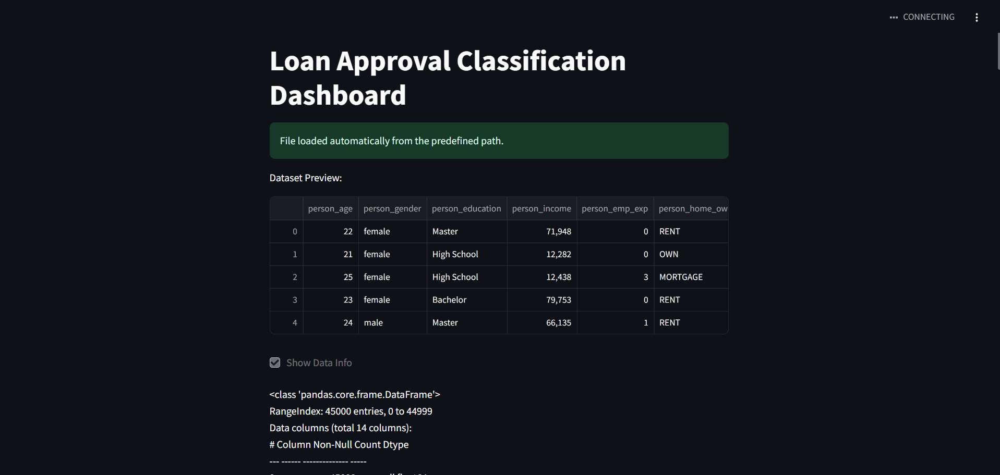
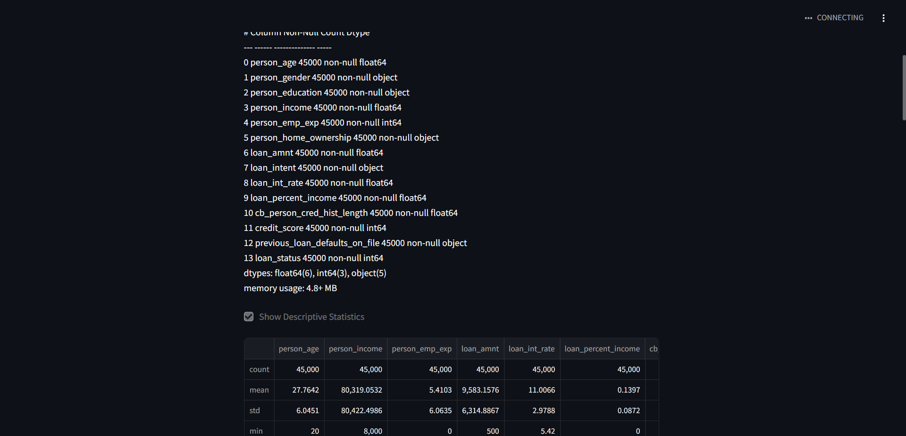
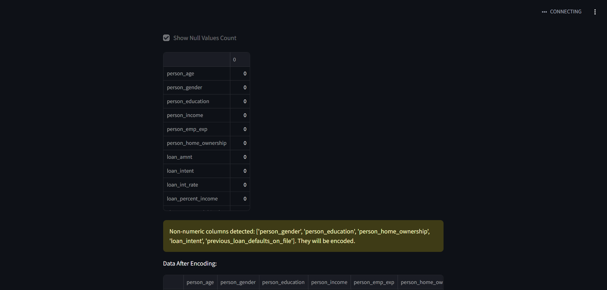
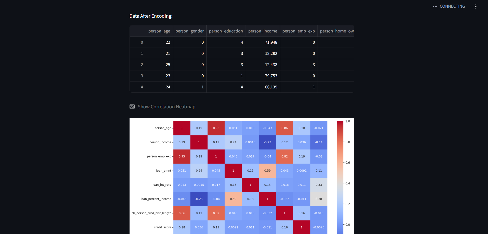
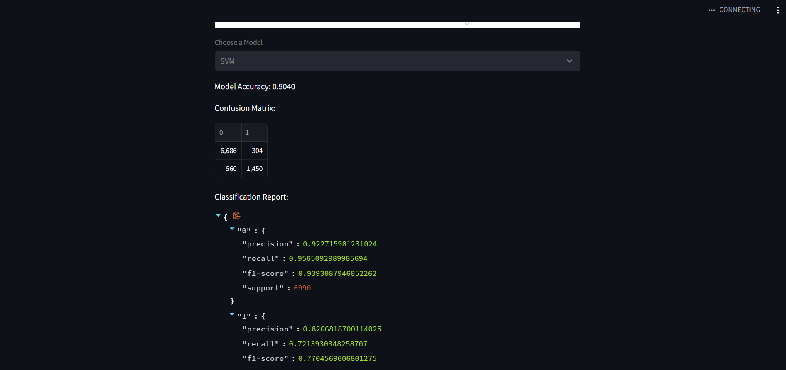
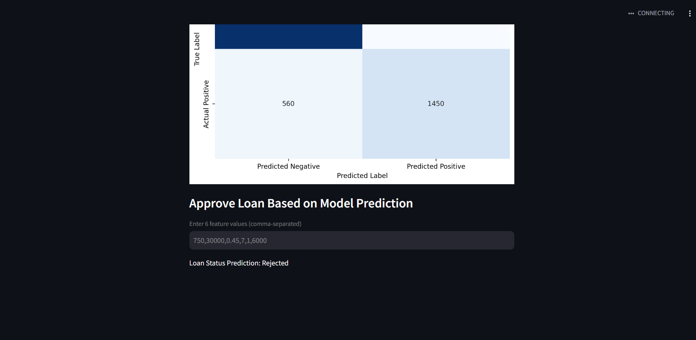

# For run this app clone git
 git clone https://github.com/RohitKumar9935459794/loan_data_detection.git

# Create an conda env
$ conda create -n myenv python=3.9

# Activate env 
 conda activate myenv

# Install requirements.txt
$  pip install -r requirment.txt

# Run the app
streamlit run app.py

      